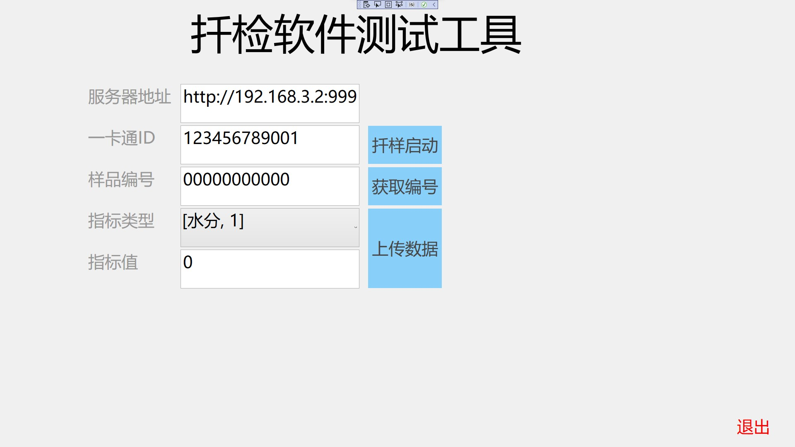

# http get tester in wpf

> wvv 20220624

a c# http protocol tester tool.

The file testflask.py is a simplest flask http server to test.



core code

```c#
public string http_get(string URL)
{
    try
    {
        HttpWebRequest request = (HttpWebRequest)WebRequest.Create(URL);
        request.Method = "GET";
        request.Timeout = 1000;
        request.ContentType = "application/x-www-form-urlencoded";
        request.KeepAlive = false;
        HttpWebResponse response = (HttpWebResponse)request.GetResponse();
        using (StreamReader reader = new StreamReader(response.GetResponseStream()))
        {
            string s = reader.ReadToEnd();
            return s;
        }
    }
    catch (Exception err)
    {
        lbl_msg.Content = err.Message;
    }
    Console.Read();
    return "failed";
}
```
